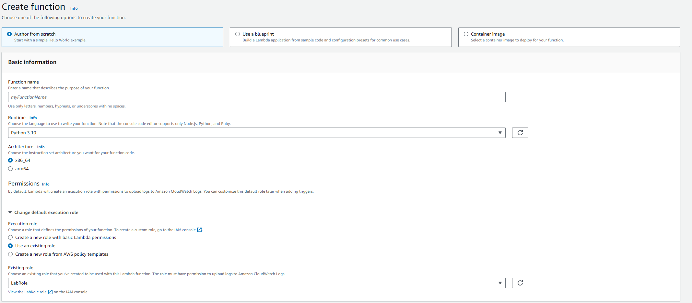
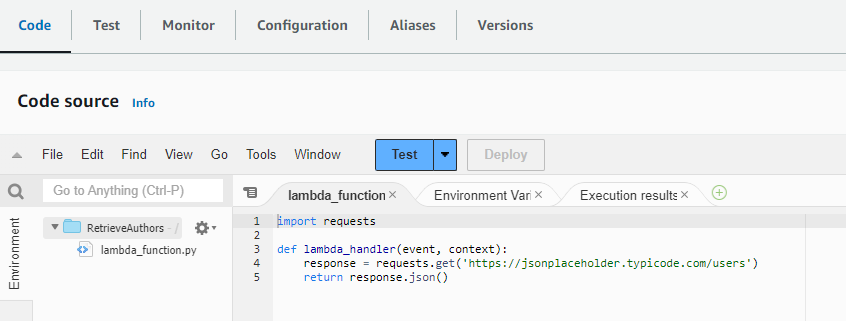
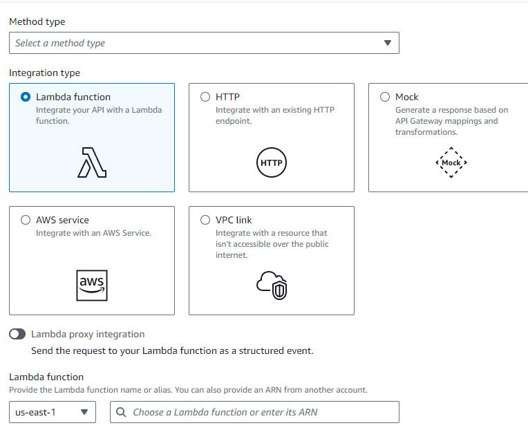
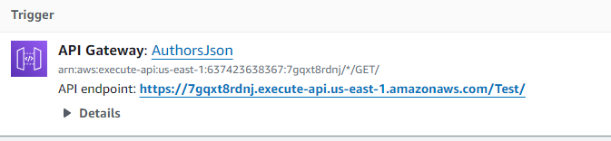
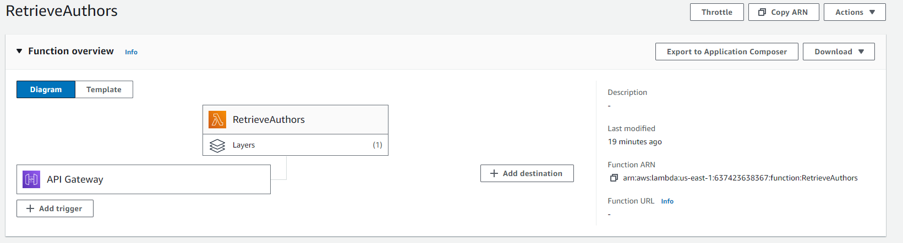

# Assessment2

Cloud Function Provisioning Assignment. This assignment involves provisioning a simple function in a Cloud Service Provider to return the same response as the API at `https://jsonplaceholder.typicode.com/users`. We will be using AWS Lambda and API Gateway. Attempted Terraform but there were some difficulties.

## Steps

1. **Launch AWS**: Start by logging into your AWS account.

2. **Go to Lambda**: Navigate to the AWS Lambda service. Select the parameters as shown below.

   

3. **Set up the function**: Edit the code and set up the new function. The function file is also included in this repo ([lambda_function.py](lambda_function.py)).

   

4. **Deploy the function**: Click on `Deploy` once you have finished setting up the function.

5. **Add a Lambda layer**: Since the Python `requests` library is not included in the AWS Lambda Python runtime by default, you will need to add a Lambda layer for it. You can find out how to do this [here](https://www.keyq.cloud/en/blog/creating-an-aws-lambda-layer-for-python-requests-module). Click on `Create layer`, then select the option `Upload a .zip file`. Add the version of Python you are using into the compatible runtime.

   **Note**: Ensure you're using Python 3.10 or higher. Versions of `urllib3` beyond v2 require OpenSSL 1.1.1+. Using older versions of Python may cause compatibility issues.

6. **Import the layer**: After you have created the Lambda layer, import it into your function by choosing `Custom layers`

7. **Create an API**: Navigate to the API Gateway and click on `Create API`. Select `REST API` > `New API`.

8. **Create a New Method**: Create a new method, selecting `GET` for the method type and `Lambda function` for the integration type. Choose the Lambda function you created earlier.

   

9. **Test Your API**: After creating the API endpoint, test it out by entering it into your web browser. Here's an example of what it might look like (note: this [link](https://7gqxt8rdnj.execute-api.us-east-1.amazonaws.com/Test/) will expire after this week).

   

   10. Integrating it with Terraform

## Function Overview

## Future Plans: Terraform Integration

I have attempted to integrate this project with Terraform. However, I encountered difficulties along the way and due to time constraints over the weekend, I was unable to fully realize this integration.

While this integration is not yet complete, I plan to update this README with more information soon. Stay tuned for updates!
